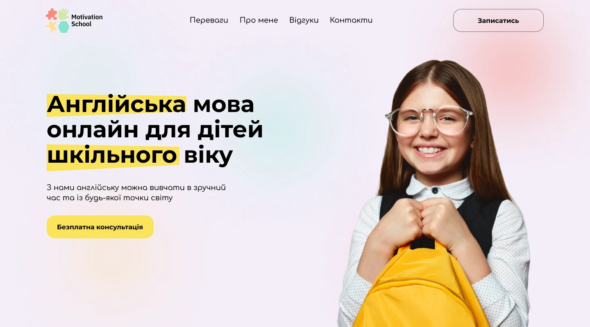

# Motivation School - English Language Online for School-Age Children

## About the Project

The **Motivation School** website presents an online tutoring center specializing in individual English lessons for school-age children. It is perfect for busy children who need a flexible learning schedule and a personalized approach. With short daily consultations on Telegram and free educational bonuses, the school provides effective and affordable learning. Parents can be confident that their children will receive quality education tailored to their personal needs and abilities, helping them quickly fill knowledge gaps and achieve academic success.

### Teacher's Mastery Profile

- **1000+** Lessons Conducted
- **30+** Satisfied Students
- **3** Completed Courses
- **2** Years of Experience

### Advantages

#### Individual Lessons

Our approach to individual lessons is based on the uniqueness of each child. We focus on your child's personal abilities and communication skills, adapting methods to achieve the best results.

#### Flexible Schedule

I offer a flexible online format for English lessons, including short daily consultations on Telegram at an affordable price. This is an ideal option for busy children, allowing them to learn effectively in just 15 minutes a day. Regularity is the key to success.

#### Free Educational Bonuses

In our program, you receive free educational materials and access to an electronic library with the best books for effective English learning and child development. We care about your success in learning without additional costs.

### About Me

My name is Yulia Serhiivna, and I am a modern English tutor. I work both online and offline in my office. I am constantly learning and developing. I invite you to my lessons. With me, it's interesting and fun!

### My Company

My company is an online tutoring center where you can learn English in individual lessons.

### My Mission

My mission is to help your child identify and fill knowledge gaps quickly and with minimal stress, which is so important in our gadget-overloaded times.

With me, you will catch up with the school program faster and more efficiently than with other tutors.

### Reviews

#### Tetyana

I want to write a review about our English lessons. We started with Yulia Serhiivna in October last year. Yegor really enjoys the lessons. The material is very clear. During this time, Yegor has learned many words, and he has improved his reading and understanding of English.

#### Olga

My child really enjoys studying with Yulia, so I definitely rate her approach to students at 12. Yulia easily found an approach to my child, and we see progress. The teacher undoubtedly uses her teaching methods, which enhance progress. We are still working towards the expected result, but I am confident that choosing this teacher was the best decision among the options offered. Thank you for your responsibility.

#### Tetyana

Thank you for your work with my child. My son really enjoyed studying with you, especially the individual lessons. My child has learned and understood a lot thanks to you.

### Frequently Asked Questions

#### What is the cost of an online lesson?

From 250 UAH depending on the level and age of the child.

#### Can a mother and child study together?

Yes, this practice is available. You will not only find a good teacher for your child in me, but you can also study together with your child if they already have a certain level of knowledge.

#### Can we start learning if the child has absolutely no knowledge?

Yes, this will not be a problem.

#### How long to wait for results?

Each lesson we cover a topic or part of a topic or work on consolidating the acquired knowledge. If you follow all my recommendations, the results will not keep you waiting.

Sign up today and get a free consultation.

## Getting Started

To start working with the project locally, follow these steps:

### Clone the Repository:

`git clone https://github.com/SoftRyzen-internship/english-teacher`

### Install Dependencies:

**Using Yarn:**
`yarn install`

**Using npm:**
`npm install``npm run dev`

### Run the Application:

**Using Yarn:**
`yarn dev`

**Using npm:**
`npm run dev`

### Open in Your Browser:

[http://localhost:3000](http://localhost:3000)

## Technologies Used

1. **Next.js** - A React framework for building modern web applications with server-side rendering and efficient routing.
2. **Tailwind CSS** - A utility-first CSS framework that accelerates the design and styling of web interfaces.
3. **TypeScript** - A strict syntactical superset of JavaScript providing optional static typing for better code clarity.
4. **Swiper** - A mobile-friendly touch slider with hardware-accelerated transitions and smooth interactions.
5. **React Hook Form** - A library for managing form state in React applications.
6. **DatoCMS** - A headless CMS that provides a user-friendly interface for managing content, with powerful APIs for seamless integration and real-time updates.

## Design

The design layout was created in Figma. You can view it [here](https://www.figma.com/design/0PkNlQ9lnOBqfh5jheS6Pa/Motivation-School?node-id=1-7693&t=8UCS39BfZ0yqHuFQ-1).

## Component API

Each component in the project has its own API, which can be found in the corresponding component's folder.

- #### component Button

| Prop       | Type      | Description                                              |
| ---------- | --------- | -------------------------------------------------------- |
| `type`     | string    | optional, the type of the button, defaults to 'submit'.  |
| `children` | ReactNode | required, the content to be displayed inside the button. |

This component renders a customizable button using the `clsx` library for conditional class names. It supports different button types and applies various styles for hover and focus states. The button content is passed as children.

- #### component ErrorMessage

| Prop      | Type   | Description                                                                               |
| --------- | ------ | ----------------------------------------------------------------------------------------- |
| `message` | string | required, the error message to be displayed. If not provided, the component returns null. |

This component renders an error message with an icon. If the `message` prop is not provided, the component returns null. It uses the `ErrIcon` SVG for the error icon and applies various styles for positioning and appearance.

- #### component Logo

| Prop        | Type   | Description                                                   |
| ----------- | ------ | ------------------------------------------------------------- |
| `className` | string | optional, additional CSS classes to style the logo component. |

This component renders a logo that links to the homepage. It uses the `clsx` library for conditional class names and includes hover and focus effects for a smooth transition. The logo image is imported as an SVG and its dimensions are set to 142x60 pixels.

- #### component Modal

| Prop        | Type      | Description                                                                |
| ----------- | --------- | -------------------------------------------------------------------------- |
| `children`  | ReactNode | required, the content to be displayed inside the modal.                    |
| `isOpen`    | boolean   | required, a boolean to control the open state of the modal.                |
| `setIsOpen` | function  | required, a function to set the open state of the modal.                   |
| `reviews`   | boolean   | optional, a boolean to determine the modal's styling based on its content. |

This component renders a modal dialog using the Radix UI library. It supports different styles based on the `reviews` prop and includes a close button with hover and focus effects. The modal content is passed as children, and its visibility is controlled by the `isOpen` and `setIsOpen` props.

- #### component Navigation

| Prop        | Type     | Description                                                          |
| ----------- | -------- | -------------------------------------------------------------------- |
| `onClick`   | function | required, a function to handle click events on the navigation links. |
| `className` | string   | optional, additional CSS classes to style the navigation component.  |

This component renders a navigation menu that adapts based on whether the user is on the homepage. It uses `react-scroll` for smooth scrolling on the homepage and `next/link` for navigation on other pages. The navigation items are dynamically generated from a JSON file.

- #### component ScrollButton

| Prop           | Type      | Description                                                     |
| -------------- | --------- | --------------------------------------------------------------- |
| `children`     | ReactNode | required, the content to be displayed inside the button.        |
| `colorButton`  | boolean   | optional, a boolean to apply color styles to the button.        |
| `borderButton` | boolean   | optional, a boolean to apply border styles to the button.       |
| `href`         | string    | required, the target section ID for the scroll link.            |
| `className`    | string    | optional, additional CSS classes to style the button component. |

This component renders a scrollable button using the `react-scroll` library. It supports different styles based on the `colorButton` and `borderButton` props, and applies various styles for hover and focus states. The button content is passed as children, and the `href` prop specifies the target section ID for smooth scrolling.

- #### component Slider

| Prop       | Type      | Description                                                         |
| ---------- | --------- | ------------------------------------------------------------------- |
| `section`  | string    | required, the section identifier to apply specific swiper settings. |
| `children` | ReactNode | required, the slides to be displayed inside the slider.             |

This component renders a customizable slider using the Swiper library. It supports different settings based on the `section` prop and includes navigation and pagination controls. The slider content is passed as children, and it adapts to different breakpoints for responsive design. The component also handles the current page state and updates the total pages dynamically.

- #### component SocialLinks

| Prop      | Type   | Description                                                                       |
| --------- | ------ | --------------------------------------------------------------------------------- |
| `section` | string | required, the section identifier to apply specific styles for different sections. |

This component renders a list of social media links using icons for Telegram, Instagram, and Mail. It dynamically maps the icons based on the social media name and applies different styles depending on the `section` prop. The social media data is sourced from a JSON file, and each link is rendered using the `SocialLink` component.

- #### component SocialLink

| Prop          | Type     | Description                                                                       |
| ------------- | -------- | --------------------------------------------------------------------------------- |
| `icon`        | React.FC | required, the icon component to be displayed.                                     |
| `link`        | string   | required, the URL for the social media link.                                      |
| `ariaLabel`   | string   | required, the aria-label for accessibility.                                       |
| `displayText` | string   | optional, the text to be displayed next to the icon in the 'contacts' section.    |
| `section`     | string   | required, the section identifier to apply specific styles for different sections. |

This component renders a social media link with an icon. It uses the `clsx` library for conditional class names and applies different styles based on the `section` prop. The link opens in a new tab and includes accessibility features like `aria-label` and `rel` attributes.

- #### component Checkbox

| Prop       | Type     | Description                                                            |
| ---------- | -------- | ---------------------------------------------------------------------- |
| `id`       | string   | required, the unique identifier for the checkbox input.                |
| `label`    | string   | required, the label text to be displayed next to the checkbox.         |
| `type`     | string   | required, the type of the input, typically 'checkbox'.                 |
| `name`     | string   | required, the name attribute for the checkbox input.                   |
| `register` | function | required, the function to register the input with React Hook Form.     |
| `errors`   | object   | required, the object containing validation errors for the form fields. |

This component renders a styled checkbox input with a label. It uses the `clsx` library for conditional class names and integrates with React Hook Form for form state management. The `ErrorMessage` component is used to display validation errors.

- #### component InputField

| Prop           | Type     | Description                                                            |
| -------------- | -------- | ---------------------------------------------------------------------- |
| `id`           | string   | required, the unique identifier for the input field.                   |
| `label`        | string   | required, the label text to be displayed above the input field.        |
| `type`         | string   | required, the type of the input, such as 'text', 'email', etc.         |
| `name`         | string   | required, the name attribute for the input field.                      |
| `register`     | function | required, the function to register the input with React Hook Form.     |
| `placeholder`  | string   | optional, the placeholder text for the input field.                    |
| `autoComplete` | string   | optional, the autocomplete attribute for the input field.              |
| `mask`         | string   | optional, the mask pattern for the input field, used with InputMask.   |
| `errors`       | object   | required, the object containing validation errors for the form fields. |

This component renders a styled input field with an optional mask using the `react-input-mask-next` library. It integrates with React Hook Form for form state management and uses the `clsx` library for conditional class names. The `ErrorMessage` component is used to display validation errors.

- #### component Textarea

| Prop          | Type     | Description                                                            |
| ------------- | -------- | ---------------------------------------------------------------------- |
| `id`          | string   | required, the unique identifier for the textarea.                      |
| `label`       | string   | required, the label text to be displayed above the textarea.           |
| `name`        | string   | required, the name attribute for the textarea.                         |
| `placeholder` | string   | optional, the placeholder text for the textarea.                       |
| `errors`      | object   | required, the object containing validation errors for the form fields. |
| `register`    | function | required, the function to register the textarea with React Hook Form.  |

This component renders a styled textarea with a label. It uses the `clsx` library for conditional class names and integrates with React Hook Form for form state management. The `ErrorMessage` component is used to display validation errors.
